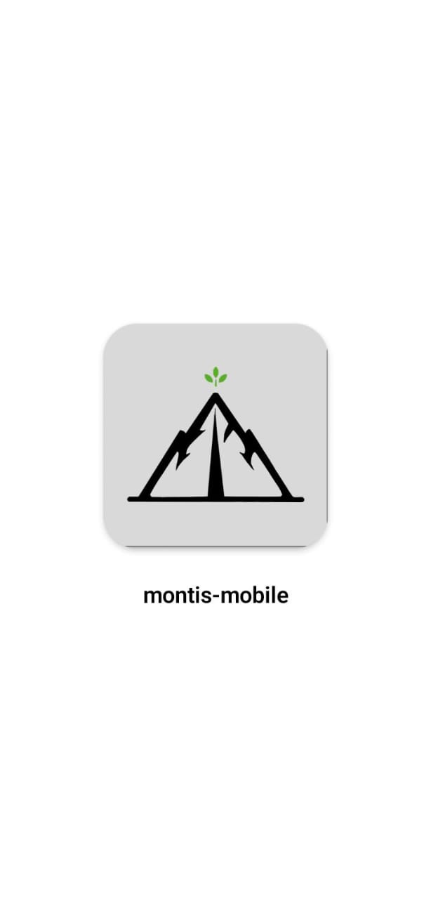
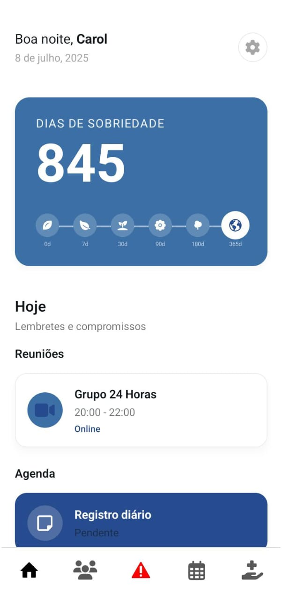
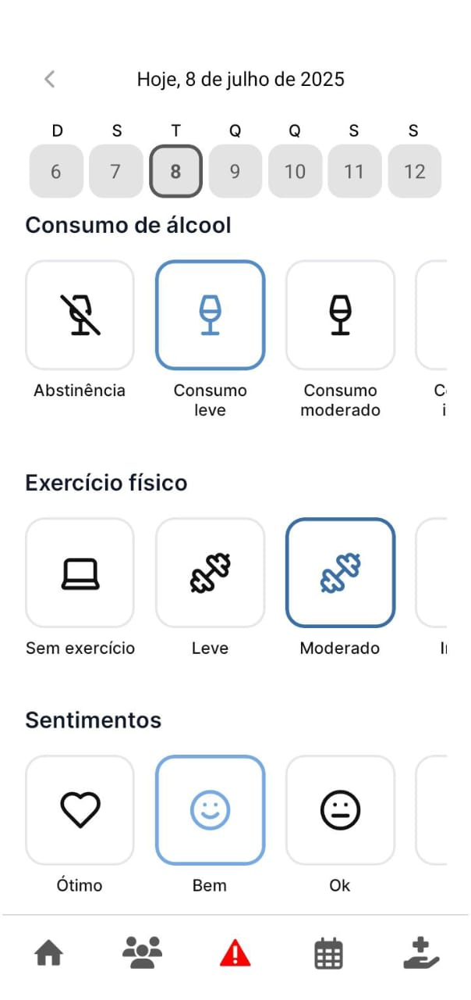
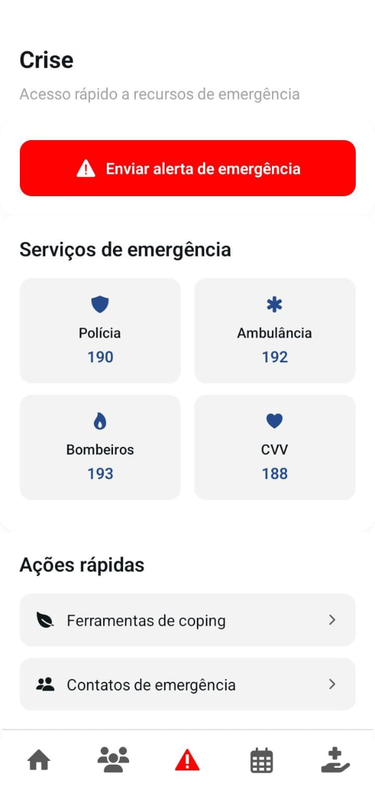
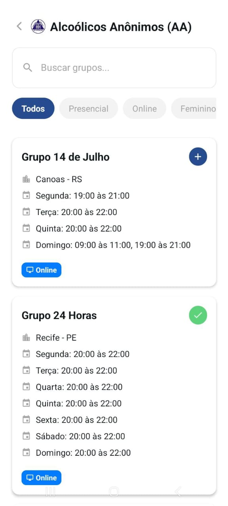

# Montis - Aplicativo de Suporte à Sobriedade

Montis é um aplicativo de suporte à sobriedade voltado para adultos em recuperação do abuso de álcool. O objetivo é fortalecer o engajamento contínuo dos usuários ao longo da jornada de recuperação, oferecendo uma experiência sensível, acolhedora e centrada no ser humano.

---

## 🛠️ Tecnologias Utilizadas

### **Frontend (Mobile)**
- React Native (Expo)
- TypeScript
- Firebase JS SDK

### **Backend (API)**
- Node.js
- NestJS
- Firebase Admin SDK
- Swagger/OpenAPI

---

## 🚀 Como Rodar o Projeto

### **Pré-requisitos**
- Node.js v18.19.1 ou superior
- [Expo CLI](https://docs.expo.dev/get-started/installation/) (`npm install -g expo-cli`)
- Conta no Firebase (para backend)

---

### **1. Clonar o repositório**

```bash
# Clone o repositório
git clone https://github.com/Carolina-dAraujo/montis-app.git
cd montis-app
```

---

### **2. Rodar o Backend (API)**

```bash
cd server

# Instale as dependências
npm install

# Configure as variáveis de ambiente
cp .env.example .env
# Edite o arquivo .env com suas credenciais do Firebase

# Inicie o servidor em modo desenvolvimento
npm run start:dev

# Acesse a documentação Swagger em:
# http://localhost:3000/api
```

---

### **3. Rodar o Frontend (Mobile)**

```bash
cd mobile

# Instale as dependências
npm install

# Inicie o projeto com Expo
npx expo start

# Use o Expo Go no seu celular para escanear o QR Code
# ou rode em um emulador Android/iOS
```

---

## 📚 Documentação

- **API:** Swagger disponível em `http://localhost:3000/api` após rodar o backend.
- **Mobile:** Estrutura baseada em Expo Router, com navegação por arquivos.

---

## 📦 Estrutura dos Diretórios

```
montis-app/
  mobile/    # Aplicativo React Native (Expo)
    assets/
      images/   # Coloque suas imagens aqui
  server/    # Backend NestJS (API)
```

---

## 🔒 Segurança

- Autenticação via Firebase (JWT)
- Validação de senha forte
- CORS habilitado para integração mobile

---

## 📝 Observações

- Para rodar o backend, é necessário configurar as credenciais do Firebase (Realtime Database e Auth).
- O frontend pode ser testado em dispositivos físicos via Expo Go ou em emuladores.

## 🖼️ Telas do Aplicativo

### Onboarding

<p align="center">
  
  
</p>

---

### Tela Inicial

<p align="center">
  
</p>

---

### Rastreamento Diário

<p align="center">
  
</p>

---

### Crise e Grupos de Apoio

<p align="center">
  
  
</p>

---

### Busca por CAPS

<p align="center">
  
</p>


